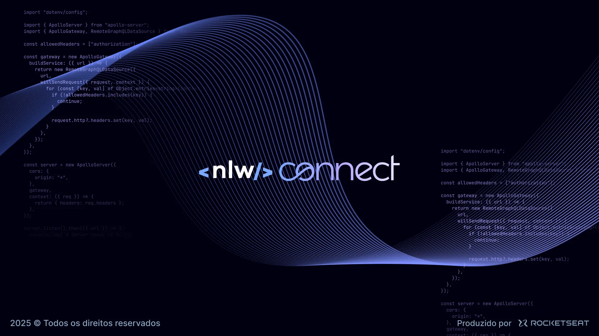

<h4 align="center">
<br>
</h4>

# Events API
Events API é, segundo a [Rocketseat](https://www.rocketseat.com.br/eventos/nlw), "[...] um software de indicação para eventos com diversas funcionalidades. Nele, o usuário pode acessar seu ingresso, gerar seu link de convite e ter acesso ao ranking de indicações".

## :page_with_curl: Sobre o projeto
Esse projeto foi desenvolvimento durante a Semana NLW de 2025, a primeira do ano da Empresa, um evento promovido pela Rocketseat (https://rocketseat.com.br), onde construimos uma aplicação completa com base em alguma trilha de alguma tecnologia (a escolhida por mim, e que é este projeto, foi Java).

## :rocket: Tecnologias usadas
- Java 17
- Spring Boot
- Spring JPA
- Docker
- MySQL

## Uso :computer: :computer_mouse:
1 - Clone este repositório;

2 - Execute o script [import_script.sql](/src/main/resources/import_script.sql) para criar as tabelas no Banco de Dados;

3 - Compile e execute a API:
```
./mvnw spring-boot:run
```

A API estará disponível em http://localhost:8080.

## Endpoints

### Criar Eventos
* Método: POST
* URL: /events

### Listar Eventos
* Método: GET
* URL: /events

### Buscar Evento pelo Pretty Name
* Método: GET
* URL: /events/{prettyName}

### Cadastrar inscrição
* Método: POST
* URL: /subscription/{prettyName}

### Cadastrar inscrição - Com indicação
* Método: POST
* URL: /subscription/{prettyName}/{userId}

### Listar ranking
* Método: GET
* URL: /subscription/{prettyName}/ranking

### Listar ranking - Por usuário
* Método: GET
* URL: /subscription/{prettyName}/ranking/{userId}

## Links úteis
- Dentro da pasta /src/main/resources há alguns arquivos para ajudarem na execução e testes do projeto:
  - [import_script.sql](/src/main/resources/import_script.sql): Script de importação das tabelas á ser executado no BD;
  - [inscritos.json](/src/main/resources/inscritos.json): Dados de testes com nomes de personagens de héroi para preenchimento de usuários dos eventos;
  - [Eventos API.postman_collection.json](/src/main/resources/Eventos%20API.postman_collection.json): Collection com todas as requests da API com exemplos preenchidos, realizadas na ferramenta Postman.
- Há a descrição completa dos Requisitos e User Stories deste projeto localizado [aqui](/src/main/resources/requisitosEUserStories.md)
- [Rocketseat](https://www.rocketseat.com.br/eventos/nlw)
- [Rocketseat NLW](https://www.rocketseat.com.br/)